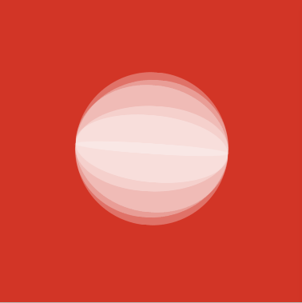
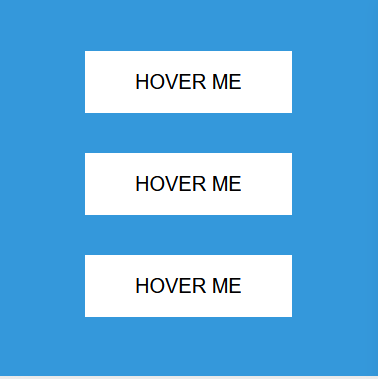
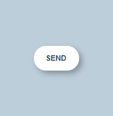
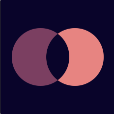
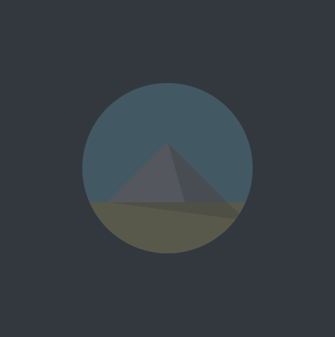

# 100 days CSS

[https://hugomencoboni.github.io/100DaysCSS/](https://hugomencoboni.github.io/100DaysCSS/).

Make your own 100 days: 
- [https://100dayscss.com](https://100dayscss.com/)
- [https://cssbattle.dev](https://cssbattle.dev/)

## Day 1 `transform-style: preserve-3d;`

Use [transform-style: preserve-3d;](https://www.w3schools.com/cssref/css3_pr_transform-style.asp) on container to preserve 3d transformations of children when container is also subject to 3d transformations.

## Day 2 `backface-visibility: hidden;`

Use [backface-visibility: hidden;](https://www.w3schools.com/cssref/css3_pr_backface-visibility.asp) when you want to hide the back face of a rotating element.

## Day 3 `animation-delay: t.tts;`

[animation-delay: t.tts;](https://www.w3schools.com/cssref/css3_pr_animation-delay.asp) can be usefull for creating trail effects.

## Day 4 `transition: cssProp... ;`

[transition: cssProp... ;](https://www.w3schools.com/cssref/css3_pr_transition.asp) is a simple way to handle animations when the `cssProp` changes by adding/removing classes, or when `:hover` is trigger or finish.

## Day 5 `transform: transformation2 transformation1;` order

The declaration order of [transform: transformation2 transformation1;](https://css-tricks.com/almanac/properties/t/transform/#multiple-values) matters and are applied from right to left!

## Day 7 checkbox with +/~ selectors

For components with "boolean" states, you can hide an checkbox with `display: none;`. Add a label for this checkbox in sibling and add your visual inside this label! You can now trigger the checked animation using + or ~ selector with `#checkboxId:checked ~ #labelId { ...`

## Day 8 triangles with border

Use `border` property to [create triangles](https://levelup.gitconnected.com/making-css-triangles-c0201dacc26).

## Day 9 `overflow: hidden;` to create figures

Some figures (like this circle intersection) are easier to create with a container with `overflow: hidden;` and a child in absolute.

## Day 10 `clip-path: xxx;` for complex shapes

Some shapes are easier to create with [`clip-path` property](https://css-tricks.com/almanac/properties/c/clip-path/).

## Day 11 use Sass rules and Emmet

Use Sass rules like [`@for`](https://sass-lang.com/documentation/at-rules/control/for), [`random`](https://sass-lang.com/documentation/modules/math#random) and others rules for factorisation and maintainability. Couple with [`Emmet`](https://code.visualstudio.com/docs/editor/emmet), generate shapes with a lot of DOM elements are quicker to write.

## Others

Start your projects with the good defaults => [https://hankchizljaw.com/wrote/a-modern-css-reset/](https://hankchizljaw.com/wrote/a-modern-css-reset/)
